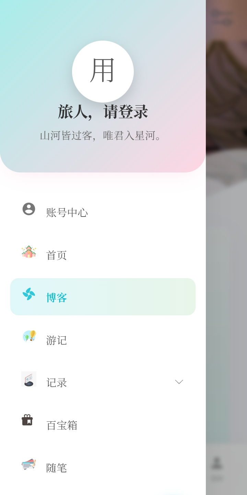
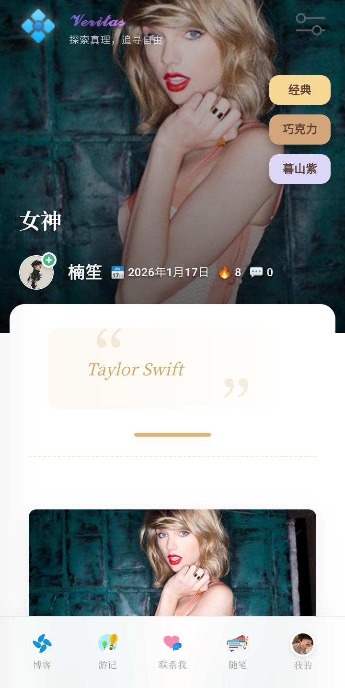
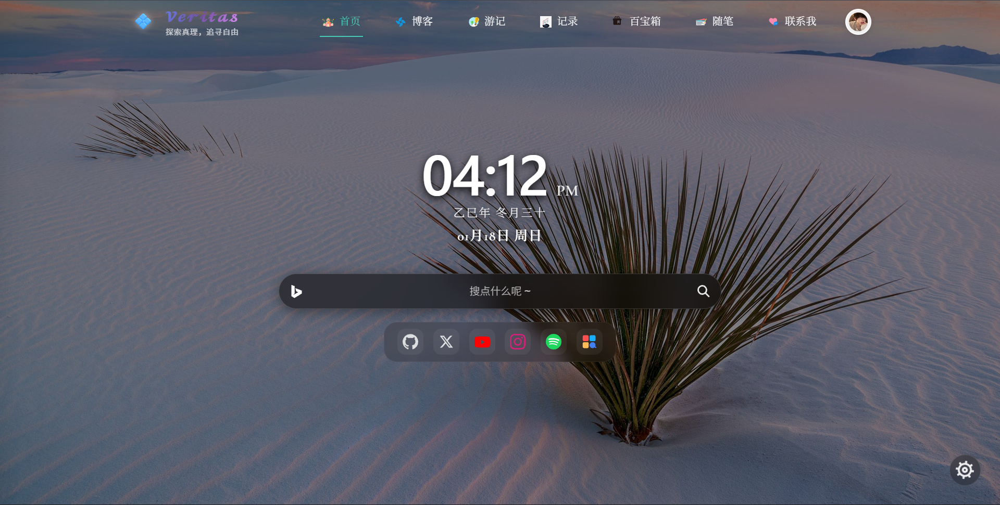
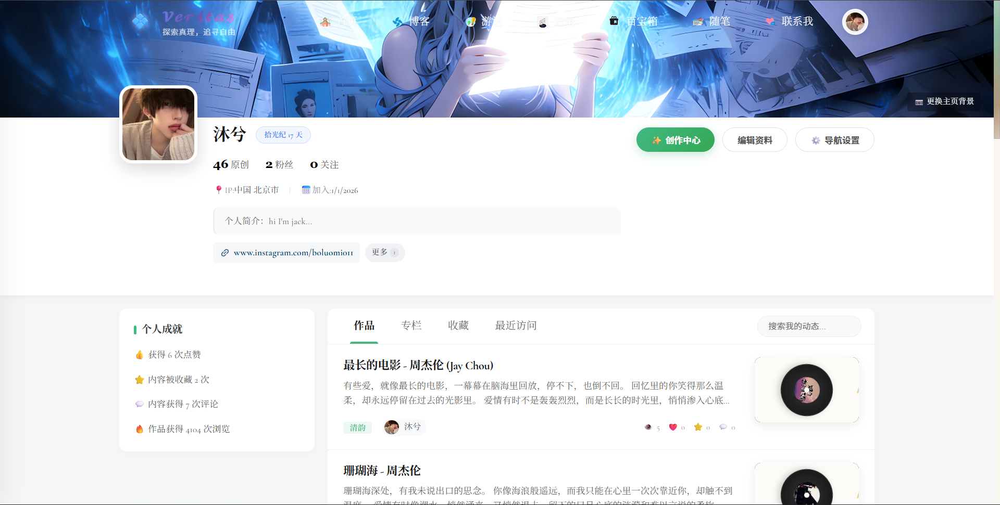
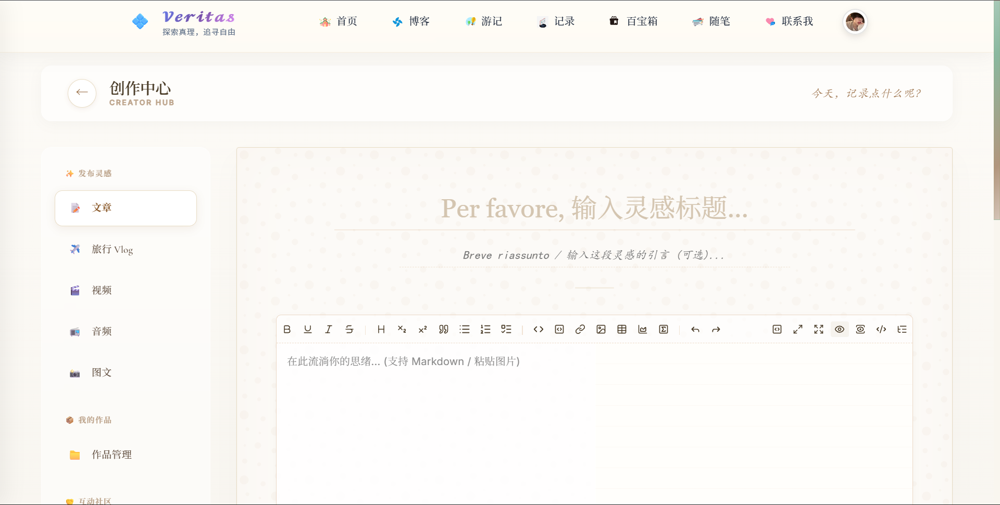
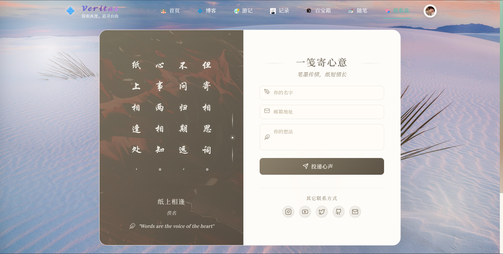
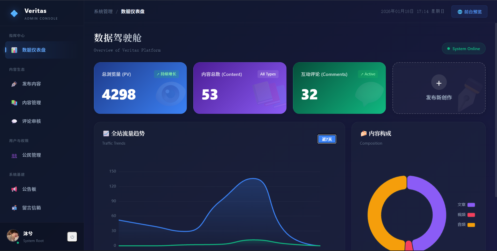

<div align="center">
  
  
  <h1 align="center">Veritas Blog Frontend</h1>
  
  <p align="center">
    <strong>探索真理，追寻自由 | Record Life, Discover Beauty</strong>
  </p>
  
  <p align="center">
    <a href="https://iveritas.cn" target="_blank">
      
    </a>
  </p>

  <p align="center">
    
    
    
    
  </p>

  <p align="center">
    <a href="https://iveritas.cn">🌍 在线演示</a> • 
    <a href="#-项目简介-introduction">项目简介</a> • 
    <a href="#-界面预览-ui-showcase">界面预览</a> • 
    <a href="#-核心亮点-highlights">核心亮点</a> • 
    <a href="#-快速运行-quick-start">快速运行</a>
  </p>
</div>

---

## 📖 项目简介 (Introduction)

**Veritas Blog Frontend** 是我个人全栈博客系统的前端部分。

它不仅仅是一个展示页面，更是一次对 **像素级 UI 还原** 与 **极致移动端适配** 的探索。项目基于 **Vue 3 + Vite** 构建，采用了极简主义设计风格，融合了 *Cinzel* 与 *Cormorant Garamond* 衬线字体，旨在提供如纸质书籍般的阅读体验。

> 💡 **注**：这是纯前端仓库。完整的全栈系统（包含 Node.js 后端与 MySQL 数据库）运行在私有仓库中。你可以访问 [iveritas.cn](https://iveritas.cn) 查看完整运行效果。

## 📸 界面预览 (UI Showcase)

### 📱 移动端极致适配 (Pixel Perfect)
针对不同尺寸的移动设备（包括 iPhone SE 等极窄屏幕）进行了深度 CSS 调优，确保布局不崩坏、文字不遮挡。

| 登录页 (iPhone SE) | 个人中心 | 博客列表 | 内容詳情 |
|:---:|:---:|:---:|:---:|
|  |  |  | 
| *CSS 双图标修复与验证码对齐* | *响应式个人中心布局* | *精美个性化 UI 导航布局* | *沉浸式阅读体验* |

### 💻 PC 端沉浸体验

#### 首页预览


#### 更多页面展示
| 博客文章页 | 个人资料页 |
|:---:|:---:|
|  |  |

| 创作中心 (CMS) | 留言/联系页 |
|:---:|:---:|
|  |  |

| 后台管理系统 (Admin Dashboard) |
|:---:|
|  |

---

## ✨ 核心亮点 (Highlights)

- **🎨 极致 UI 设计**: 
  - 拒绝千篇一律的 UI 库默认样式，核心组件（输入框、按钮、弹窗）均为手工定制 CSS。
  - 引入复古衬线字体，配合打字机动画，营造独特氛围。

- **🔐 交互细节打磨**:
  - **密码框优化**: 解决了现代浏览器自动注入 "查看密码" 图标导致双图标重叠的 Bug。
  - **验证码适配**: 在宽度 <320px 的极限场景下，通过 Flex 布局智能缩放，保证验证码与输入框完美对齐且不被覆盖。
  - **平滑过渡**: 路由切换与组件加载均包含精心设计的过渡动画。

- **🛠 技术栈**:
  - Vue 3 (Composition API)
  - Vite
  - Vue Router 4
  - Axios (拦截器封装)
  - CSS3 Variables (深色模式支持基础)

---

## 🚀 快速运行 (Quick Start)

如果你想在本地运行查看效果：

### 1. 克隆项目
```bash
git clone [https://github.com/Lum-aurous/my-blog-frontend.git](https://github.com/Lum-aurous/my-blog-frontend.git)
cd my-blog-frontend

```

### 2. 安装依赖

```bash
npm install

```

### 3. 启动开发服务器

```bash
npm run dev

```

访问控制台输出的地址（通常是 `http://localhost:5173`）即可预览。

*(注：由于后端 API 未连接，部分需要数据交互的功能可能无法正常响应，但不影响 UI 查阅)*

---

<div align="center">
Designed & Developed with ❤️ by <strong>Jack Bo</strong>
</div>